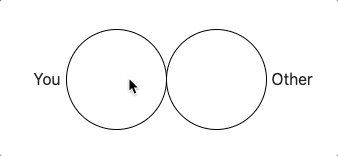
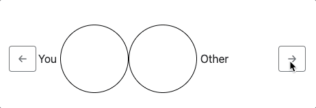
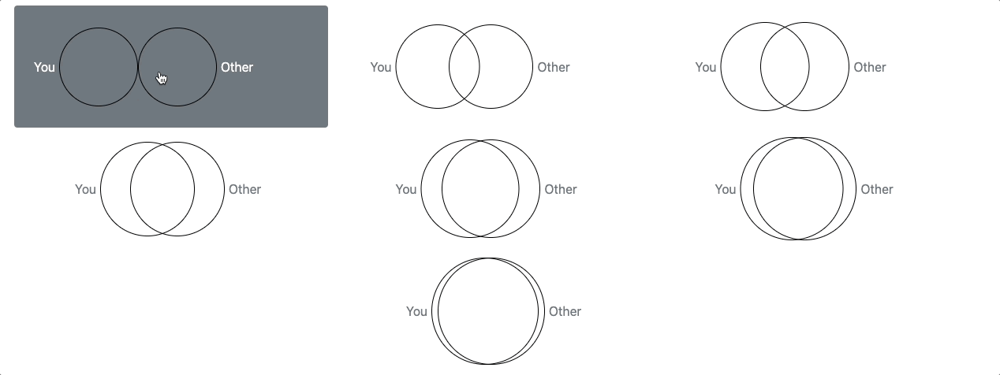

# `ios.js`

A JavaScript implementation of the Inclusion of Other in the Self (IOS) scale *that satisfies its original design features*.

`ios.js` offers three versions:
- Continuous IOS scale: fully continuous IOS scale



- Step-choice IOS scale: discrete IOS scale that allows for many circles via back-and-forth buttons



- Standard IOS scale



Number of pairs of circles, circle sizes, and labels (among other options) can be easily customised.
We also offer [extended versions of the discrete IOS scales](https://github.com/geoffreycastillo/ios-js/wiki/Extended-IOS-scales) (unbalanced or inspired by [IOS11](https://www.nottingham.ac.uk/cedex/news/papers/2023-10.aspx)) that add intermediate circles.

## Demo

https://geoffreycastillo.com/ios-js-demo/

## Paper

We present `ios.js`, and in particular the Continuous IOS scale, in more details in our paper: [Beranek and Castillo (2022) Continuous Inclusion of Other in the Self](https://geoffreycastillo.com/pdf/Beranek,Castillo-Continuous-Inclusion-of-Other-in-the-Self.pdf).

If you use `ios.js`, please cite it!

## Installation

`ios.js` uses [`interact.js`](https://github.com/taye/interact.js/).
It is tested with version `1.10.17`.
Refer to their page for instructions on how to install; for example, with a CDN:

```
<script src="https://cdn.jsdelivr.net/npm/interactjs@1.10.17/dist/interact.min.js"></script>
```

Then, download `ios.js` from the [releases](https://github.com/geoffreycastillo/ios-js/releases) and include it:

```
<script src="ios.js" type="text/javascript"></script>
```

or use a CDN such as [jsDelivr](https://www.jsdelivr.com/):

```
<script src="https://cdn.jsdelivr.net/gh/geoffreycastillo/ios-js/ios.min.js"></script>
```

When you use `ios.js` in a real experiment, you should specify a version number by replacing `ios-js` with `ios-js@x.x.x` in the link, where `x.x.x` corresponds to one of the version numbers in the [releases](https://github.com/geoffreycastillo/ios-js/releases). 
For example, to use `0.2.0`:

```
<script src="https://cdn.jsdelivr.net/gh/geoffreycastillo/ios-js@0.2.0/ios.min.js"></script>
```

Otherwise, you will use the last version and run the risk that I push a new version while your experiment is running, which could break something.

## Quick start

```
# html
<div id="ios-continuous"></div>
Proportion overlap: <span id="continuous-ios-overlap"></span>
Proportion distance: <span id="continuous-ios-distance"></span>


# js
<script src="https://cdn.jsdelivr.net/npm/interactjs@1.10.17/dist/interact.min.js"></script>
<script src="https://cdn.jsdelivr.net/gh/geoffreycastillo/ios-js@0.2.0/ios.min.js"></script>
<script>
    const iosContinuous = new Ios({
        el: 'ios-continuous',
    });

    const continuous_ios_distance_input = document.getElementById('continuous-ios-distance');
    const continuous_ios_overlap_input = document.getElementById('continuous-ios-overlap');

    document.getElementById('ios-continuous').addEventListener(
        'mousedown',
        () => {
            window.addEventListener(
                'mouseup',
                () => {
                    continuous_ios_distance_input.innerHTML = iosContinuous.proportionDistance;
                    continuous_ios_overlap_input.innerHTML = iosContinuous.proportionOverlap;
                },
                false)
        }, false
    );
</script>
```

## Qualtrics? oTree?

See the wiki for instructions on [how to use `ios.js` with Qualtrics](https://github.com/geoffreycastillo/ios-js/wiki/Qualtrics).

For oTree, we have a [separate demo app](https://github.com/geoffreycastillo/ios_js_otree_demo).

## Other examples

For the Step-Choice IOS scale with 10 pairs of cirles:

```
# html
<div id="ios-step-choice"></div>
# js
const iosStepChoice = new Ios({
    el: 'ios-step-choice',
    type: 'step-choice',
    numberCircles: 10
});
```

For the original IOS scale:

```
# html
<div id="ios-pictorial"></div>
# js
const iosPictorial = new Ios({
    el: 'ios-pictorial',
    type: 'original'
});
```


## Documentation

See the [wiki](https://github.com/geoffreycastillo/ios-js/wiki) for the [API documentation](https://github.com/geoffreycastillo/ios-js/wiki/API-Documentation).

## Bugs? Suggestions?

[Open an issue](https://github.com/geoffreycastillo/ios-js/issues) or a [pull request](https://github.com/geoffreycastillo/ios-js/pulls), or email me
at [`geoffrey.castillo@univie.ac.at`](mailto:geoffrey.castillo@univie.ac.at).

## Licence

`ios.js` is licensed under the [GNU General Public License v3.0](https://www.gnu.org/licenses/gpl-3.0.en.html).

Copyright (c) 2022 Geoffrey Castillo
